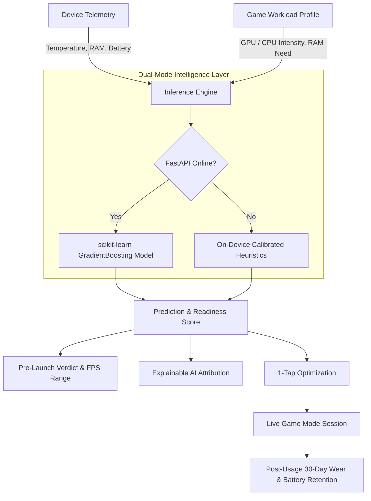

# KATSU — AI Phone Performance Enactor (iQOO 13 Flagship Edition)

> An AI-powered predictive performance intelligence system calibrated for modern high-performance smartphones and the **iQOO 13 (Snapdragon® 8 Elite)**.

---

## Problem Statement

Modern flagship gaming smartphones pack desktop-grade silicon, high-refresh-rate displays, and advanced vapor chambers. However, mobile gaming performance remains **unpredictable and reactive**:

* **Blind Workload Launching**: Users launch demanding AAA titles (e.g., *Genshin Impact*, *Honkai: Star Rail*, *Call of Duty: Mobile*) without knowing whether their phone's current thermal state, memory saturation, or battery level can sustain stable gameplay.
* **Aggressive Thermal Throttling**: Extended gameplay causes surface and SoC temperatures to climb above throttle thresholds (41.5°C+), causing sudden FPS drops, stuttering, and ruined competitive sessions.
* **Accelerated Battery Degradation**: High thermal stress combined with fast charging accelerates long-term lithium-ion capacity loss, yet users receive no visibility into which titles contribute most to hardware wear.
* **Reactive, Non-Actionable Tools**: Built-in system monitors only show raw, reactive numbers (e.g., CPU %, current °C) rather than predictive guidance on session stability *before* a game is launched.

---

## Our Solution

**KATSU** shifts mobile performance management from **reactive monitoring** to **predictive intelligence**:

1. **Pre-Launch Prediction**: Analyzes target game workload specifications against real-time hardware telemetry to forecast frame rates, thermal headroom, and memory margins before starting.
2. **Actionable Pre-Game Optimization**: Provides estimated frame rate gains and one-tap background resource cleanup ("Optimize For Me") to ensure optimal headroom.
3. **Live Game Mode Monitoring**: Delivers a real-time frame rate stream, 1% low metrics, and dynamic thermal differential tracking.
4. **Post-Usage Degradation Intelligence**: Tracks 30-day battery health retention, attributes hardware wear on a per-app basis, and provides AI-generated mitigation recommendations.

---

## Key Features

* **Game Readiness & Predictive Engine**: Calculates a composite 0–100 Readiness Score and predicts an expected FPS range (e.g., 48–60 FPS) tailored to the Snapdragon 8 Elite platform.
* **Curated Catalog & Custom APK Analyzer**: Includes pre-calibrated benchmarks for popular AAA titles alongside a custom benchmark tool to evaluate unlisted games and APKs by RAM and GPU intensity.
* **Explainable AI Layer ("Why This Result?")**: Uses model feature importance to show exactly how GPU capability, thermal resistance, and RAM margins influenced the prediction.
* **Live In-Session Telemetry Stream**: Rolling SVG frame rate graph, 1% low pacing calculations, and session duration tracking.
* **30-Day Battery Wear & Degradation Tracker**: Visualizes battery health retention curves, per-title wear percentages, and actionable tips (e.g., bypass charging benefits).
* **Interactive Telemetry Simulator**: Built-in simulation tool with instant presets (*Cool 32°C*, *Nominal 39°C*, *Throttle 43.5°C*) and granular temperature sliders for testing hardware states.
* **Audio AI Briefing**: Native Web Speech API integration providing spoken performance advisories.
* **Dynamic Connection Awareness**: Real-time status indicator displaying `ACTIVE` when connected to the trained machine learning backend, with seamless fallback to on-device heuristics when offline.

---

## Tech Stack

### Frontend Application
* **HTML5 & CSS3**: Custom design system featuring dark glassmorphism, responsive grid/flexbox layouts, Space Grotesk typography, and DM Mono data displays.
* **Vanilla JavaScript (ES6+)**: Zero-dependency, lightweight client architecture managing navigation, real-time charting, and API communication.
* **SVG Visualizations**: Dynamic SVG path rendering for rolling frame-rate streams and 30-day battery retention curves.
* **Web Speech API**: Integrated voice synthesis for hands-free audio briefings.

### Machine Learning & Backend
* **Python 3.10+**: Core backend runtime.
* **FastAPI**: High-performance asynchronous REST API serving inference endpoints (`/predict`, `/health`, `/games`).
* **scikit-learn**:
  * `GradientBoostingRegressor`: Predicts continuous performance scores ($R^2 = 0.963$) and frame rates ($R^2 = 0.993$).
  * `RandomForestClassifier`: Multi-class classification for thermal throttle risk and battery impact.
* **Joblib & NumPy**: Model serialization and matrix operations.
* **Node.js**: Lightweight static web server (`serve.js`).

---

## Architecture & Workflow



1. **Telemetry Ingestion**: Gathers battery level, memory utilization, storage headspace, and surface temperature.
2. **Workload Parameterization**: Extracts game demands (RAM requirement, target refresh rate, GPU load factor).
3. **Inference Execution**: Queries the FastAPI ML backend or executes local mathematical modeling.
4. **Insight Delivery**: Displays the verdict, frame rate expectations, feature attribution, and optimization options.
5. **Session Monitoring & Wear Tracking**: Streams live gameplay telemetry and logs cumulative battery wear.

---

## Future Implementations

* **Direct Android ADB / Kernel Daemon Bridge**: Integration with low-level Android hardware interfaces (`sysfs`, `/sys/class/thermal/`, `dumpsys batterystats`) for automated background polling on physical hardware.
* **Dynamic In-Game Resolution & Refresh Rate Scaling**: Automated adjustments to display refresh rates (144Hz / 120Hz / 60Hz) and resolution downsampling when thermal throttling thresholds are approached.
* **Automated Bypass Charging Triggers**: Automatic system signals to engage battery bypass charging when high thermal load is detected during plugged-in play.
* **Crowdsourced Workload Benchmark Registry**: Cloud-synchronized profiles of community-tested game settings across varying ambient temperatures.
* **Multi-SoC Platform Profiles**: Expansion beyond the Snapdragon 8 Elite to support MediaTek Dimensity and Apple silicon architectures.

---

## Presentation & Media Links

### YouTube Demo Video
<!-- Paste your YouTube video link below -->
[Watch the Demo Video](https://www.youtube.com/)

### Presentation / Pitch Deck (Google Drive)
<!-- Paste your Google Drive pitch deck link below -->
[View Pitch Deck on Google Drive](https://drive.google.com/)

---

## Quickstart Guide

### 1. Start the Machine Learning Backend
```bash
# Navigate to repository root
pip install -r backend/requirements.txt

# Launch FastAPI server
uvicorn backend.main:app --host 127.0.0.1 --port 8000
```
* API Documentation: `http://127.0.0.1:8000/docs`
* Health Check: `http://127.0.0.1:8000/health`

### 2. Launch the Web Application
```bash
# Run the local static server
node serve.js
```
Open your browser and navigate to:
👉 **`http://localhost:3000`**
